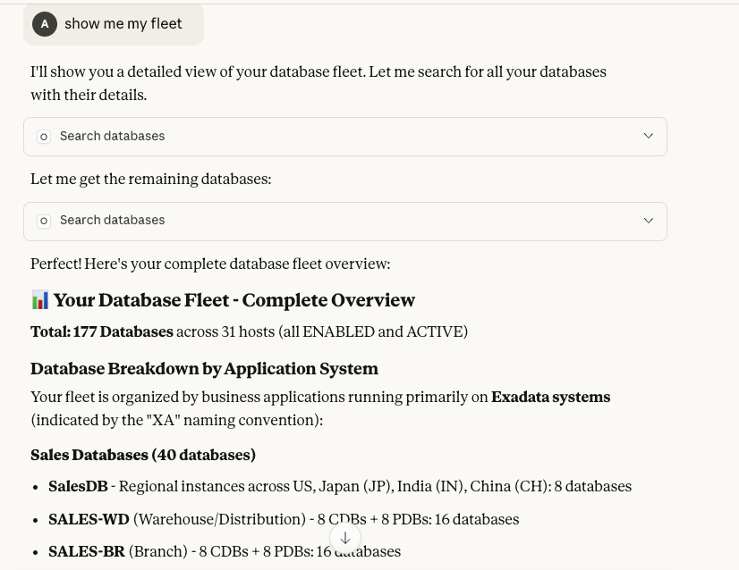
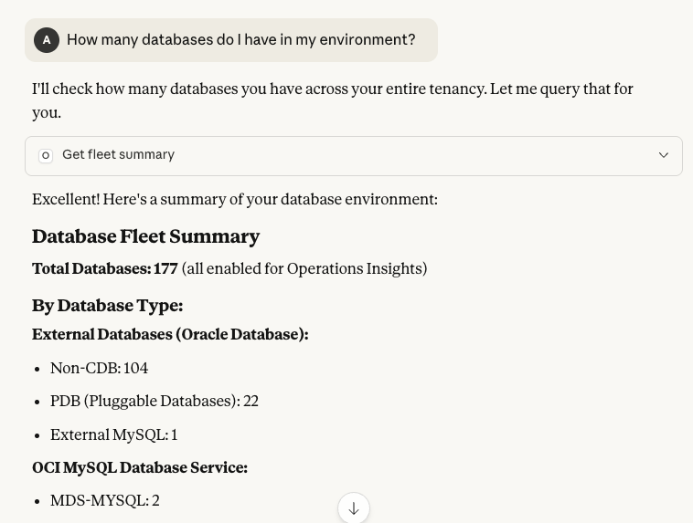
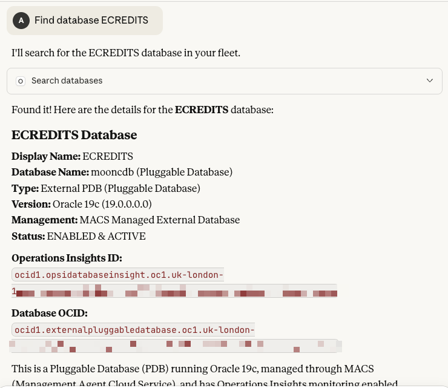

# MCP OCI OPSI Server

**Version 2.0** | **117 Tools** | **Read-Only** | **Multi-Tenancy**

MCP (Model Context Protocol) server for Oracle Cloud Infrastructure (OCI) Operations Insights. This server provides tools to query and analyze OCI Operations Insights data through Claude Desktop or Claude Code.

> **📚 Complete Documentation**: See [README_UPDATED.md](./README_UPDATED.md) for comprehensive v2.0 documentation, or visit the [GitHub Wiki](./wiki/Home.md) for detailed guides.
>
> **🚀 Quick Start**: [Installation Guide](./wiki/Installation.md) | [Quick Start](./wiki/Quick-Start.md) | [API Coverage](./wiki/API-Coverage.md)

## Architecture Overview

### System Architecture

```
┌─────────────────────────────────────────────────────────────────────────┐
│                                                                         │
│                            USER / APPLICATION                           │
│                                                                         │
└────────────────────────────────┬────────────────────────────────────────┘
                                 │
                    Natural Language Queries
                    "Show CPU forecast for next 30 days"
                    "Which SQL statements are degrading?"
                                 │
                                 ▼
┌─────────────────────────────────────────────────────────────────────────┐
│                                                                         │
│                         LARGE LANGUAGE MODEL (LLM)                      │
│                         (Claude, GPT, etc.)                             │
│                                                                         │
│  • Understands user intent                                             │
│  • Converts questions to structured MCP tool calls                     │
│  • Formats responses in natural language                               │
│                                                                         │
└────────────────────────────────┬────────────────────────────────────────┘
                                 │
                    MCP Protocol (JSON-RPC)
                    Tool calls with parameters
                                 │
                                 ▼
┌─────────────────────────────────────────────────────────────────────────┐
│                                                                         │
│                    MCP OCI OPERATIONS INSIGHTS SERVER                   │
│                         (This Application)                              │
│                                                                         │
│  ┌───────────────────────────────────────────────────────────────────┐ │
│  │  MCP Tools Layer (117 Tools)                                    │ │
│  │  • list_database_insights()                                      │ │
│  │  • summarize_sql_statistics()                                    │ │
│  │  • get_host_resource_forecast_trend()                           │ │
│  │  • get_host_capacity_planning()                                 │ │
│  │  • list_users() / list_tablespaces() [NEW v2.0]                │ │
│  │  • ... and 110 more tools                                       │ │
│  └───────────────────────────────────────────────────────────────────┘ │
│                                 │                                       │
│  ┌───────────────────────────────────────────────────────────────────┐ │
│  │  Business Logic Layer                                            │ │
│  │  • Parameter validation                                          │ │
│  │  • Response formatting for LLM                                   │ │
│  │  • Error handling & troubleshooting                             │ │
│  │  • Region detection & routing                                    │ │
│  └───────────────────────────────────────────────────────────────────┘ │
│                                 │                                       │
│  ┌───────────────────────────────────────────────────────────────────┐ │
│  │  OCI SDK Client Layer                                            │ │
│  │  • Authentication (OCI config + key)                             │ │
│  │  • Client caching (16 cached clients)                           │ │
│  │  • Multi-region support                                          │ │
│  │  • API pagination handling                                       │ │
│  └───────────────────────────────────────────────────────────────────┘ │
│                                                                         │
└────────────────────────────────┬────────────────────────────────────────┘
                                 │
                    HTTPS REST API Calls
                    (Regional endpoints)
                                 │
                                 ▼
┌─────────────────────────────────────────────────────────────────────────┐
│                                                                         │
│                    ORACLE CLOUD INFRASTRUCTURE                          │
│                                                                         │
│  ┌──────────────────────────┐  ┌──────────────────────────┐           │
│  │  Operations Insights     │  │  Database Management     │           │
│  │  Service                 │  │  Service                 │           │
│  │                          │  │                          │           │
│  │  • Host Insights         │  │  • Managed Databases     │           │
│  │  • Database Insights     │  │  • SQL Plan Baselines    │           │
│  │  • SQL Statistics        │  │  • Performance Hub       │           │
│  │  • Capacity Planning     │  │  • ADDM                  │           │
│  │  • Forecasting (ML)      │  │  • AWR                   │           │
│  │  • OPSI Warehouse        │  │                          │           │
│  └──────────────────────────┘  └──────────────────────────┘           │
│                                                                         │
│  Regional Endpoints:                                                   │
│  • operationsinsights.{region}.oci.oraclecloud.com                    │
│  • database.{region}.oraclecloud.com                                   │
│                                                                         │
└─────────────────────────────────────────────────────────────────────────┘
```

### Data Flow Example

**User Query**: *"Show me hosts with high CPU usage in the last week"*

```
1. LLM receives natural language query
   ↓
2. LLM determines appropriate MCP tool:
   → get_host_resource_statistics(
       compartment_id="ocid1.compartment...",
       resource_metric="CPU",
       time_interval_start="2025-11-11T00:00:00Z",
       time_interval_end="2025-11-18T00:00:00Z"
     )
   ↓
3. MCP Server processes request:
   • Validates parameters
   • Authenticates with OCI using config file
   • Detects region from compartment OCID
   • Creates/retrieves cached OCI client
   ↓
4. MCP Server calls OCI API:
   GET https://operationsinsights.uk-london-1.oci.oraclecloud.com/
       20200630/hostInsights/resourceStatistics
   ↓
5. OCI Operations Insights processes:
   • Queries telemetry database
   • Aggregates metrics across time range
   • Returns structured data
   ↓
6. MCP Server formats response:
   {
     "compartment_id": "ocid1.compartment...",
     "resource_metric": "CPU",
     "items": [
       {
         "host_name": "DBM08adm03",
         "usage": 625.29,
         "capacity": 1440,
         "utilization_percent": 43.42
       }
     ],
     "count": 24
   }
   ↓
7. LLM receives structured data and formats natural response:
   "I found 24 hosts. The highest CPU usage is on DBM08adm03
    with 43.42% utilization (625 of 1440 CPUs in use)."
```

### Component Responsibilities

#### 1. **Large Language Model (LLM)**
- **Input**: Natural language questions from users
- **Processing**:
  - Understands user intent
  - Maps questions to appropriate MCP tools
  - Generates structured tool calls with correct parameters
- **Output**: Natural language responses based on structured data

#### 2. **MCP OCI Operations Insights Server**
- **Input**: Structured MCP tool calls (JSON-RPC)
- **Processing**:
  - Validates parameters (compartment IDs, time ranges, metrics)
  - Authenticates with OCI (reads ~/.oci/config)
  - Routes requests to correct regional endpoints
  - Handles pagination for large result sets
  - Formats responses for LLM consumption
  - Provides error handling and troubleshooting guidance
- **Output**: Structured JSON responses optimized for LLM parsing

#### 3. **Oracle Cloud Infrastructure**
- **Input**: Authenticated REST API calls
- **Processing**:
  - Operations Insights Service:
    - Collects telemetry from databases and hosts
    - Stores metrics in time-series database
    - Runs ML models for forecasting
    - Aggregates data across fleet
  - Database Management Service:
    - Manages SQL plan baselines
    - Provides AWR and ADDM data
    - Tracks database configuration
- **Output**: Raw metrics and insights data

### Authentication Flow

```
┌──────────┐
│   MCP    │
│  Server  │
└────┬─────┘
     │
     │ 1. Read OCI config
     ├────────────────────────────┐
     │                            │
     ▼                            ▼
┌─────────────────┐      ┌──────────────────┐
│ ~/.oci/config   │      │ ~/.oci/key.pem   │
│                 │      │                  │
│ [DEFAULT]       │      │ (Private Key)    │
│ user=ocid1...   │      │                  │
│ tenancy=ocid1...│      └──────────────────┘
│ region=us-phx-1 │
│ key_file=~/.oci/│
│     key.pem     │
└─────────────────┘
     │
     │ 2. Create signed request
     ▼
┌─────────────────────────────────┐
│  OCI API Request                │
│  Headers:                       │
│  • Authorization: Signature ... │
│  • Date: ...                    │
│  • Host: ...                    │
└─────────────────────────────────┘
     │
     │ 3. Send to OCI
     ▼
┌─────────────────────────────────┐
│  Oracle Cloud Infrastructure    │
│  • Verifies signature           │
│  • Checks IAM policies          │
│  • Returns data if authorized   │
└─────────────────────────────────┘
```

### Multi-Region Support

The MCP server automatically handles multi-region deployments:

```
User Query: "Show databases in all regions"
              ↓
         MCP Server
              ↓
    ┌─────────┴─────────┐
    ▼                   ▼
┌──────────┐      ┌──────────┐
│ Region 1 │      │ Region 2 │
│ us-phx-1 │      │ uk-lon-1 │
└────┬─────┘      └────┬─────┘
     │                 │
     ▼                 ▼
  [Data 1]         [Data 2]
     │                 │
     └────────┬────────┘
              ▼
      Aggregated Response
```

**Region Detection Methods:**
1. **From OCID**: `ocid1.opsidatabaseinsight.oc1.uk-london-1.xxx` → uk-london-1
2. **From Cache**: Database cache stores region per database
3. **From Config**: Default region in ~/.oci/config
4. **Explicit**: User can specify region parameter

## Features

**Total: 117 MCP Tools for comprehensive OCI database operations** 📊

### 🎉 What's New in v2.0 (November 2025)

#### ✨ 18 New APIs
- **Resource Statistics** (4 APIs) - Database resource monitoring and analytics
- **User Management** (6 APIs) - User, role, and privilege auditing
- **Tablespace Management** (3 APIs) - Storage monitoring and analysis
- **AWR Metrics** (5 APIs) - Performance troubleshooting with wait events

#### 🤖 Agent Detection & Prioritization
- **Automatic agent type detection** - MACS, Cloud Agent, or EM Agent
- **Priority classification** - 3-tier priority system (1=full API support, 3=limited)
- **API compatibility matrix** - Know which APIs work with each agent type
- **Migration recommendations** - Smart suggestions for EM-managed databases

#### 👥 Enhanced Multi-Tenancy
- **Interactive profile selection** - Choose OCI profile without environment changes
- **7 new profile management tools** - Validate, compare, and switch profiles
- **Multi-account support** - Manage production, staging, development simultaneously
- **Profile-specific caching** - Separate cache per tenancy

#### 📖 Complete Documentation (85% coverage)
- **8 GitHub wiki pages** - Installation, configuration, troubleshooting
- **API coverage report** - All 117 tools cataloged
- **Read-only design** - Safe for production (no write operations)

### 🆕 Previous Updates: EM-Managed Database Support
- **Automatic EM-Managed Detection** - Identifies Enterprise Manager-managed databases
- **Warehouse Query Fallback** - Transparent fallback when direct APIs unavailable
- **Clear Error Messages** - No misleading "permission denied" errors
- **Actionable Alternatives** - Concrete solutions (warehouse, Database Management APIs)

### Enhanced Profile Management Tools (11 tools) 🆕
- **list_oci_profiles_enhanced()**: List all profiles with comprehensive validation
- **get_oci_profile_details(profile)**: Get detailed profile configuration
- **validate_oci_profile(profile)**: Validate profile setup
- **get_profile_tenancy_details(profile)**: Get tenancy information
- **compare_oci_profiles(profiles)**: Compare multiple profiles side-by-side
- **refresh_profile_cache()**: Clear and refresh profile cache
- **get_current_profile_info()**: Get current active profile details
- *Plus 4 original utility tools (ping, whoami, list_oci_profiles, get_profile_info)*

### Utility & Configuration Tools (4)
- **ping()**: Simple health check to verify the MCP server is responsive
- **whoami()**: Get current OCI user and tenancy information from configuration
- **list_oci_profiles()**: List all available OCI CLI profiles and show current active profile
- **get_profile_info()**: Get detailed configuration information for a specific profile

### Fast Cache Tools - Instant Responses, Zero API Calls (7) 🚀
- **get_fleet_summary()**: Ultra-fast fleet overview with zero API calls - minimal tokens
- **search_databases()**: Instant database search using local cache
- **get_databases_by_compartment()**: Get all databases in a compartment - token-efficient
- **get_cached_statistics()**: Detailed cache statistics and metadata
- **list_cached_compartments()**: List all compartments in cache
- **build_database_cache()**: Build/rebuild local cache by scanning compartments recursively
- **refresh_cache_if_needed()**: Check cache validity and refresh status

### Database Insights - Core Operations (5)
- **list_database_insights()**: List database insights in a compartment with filtering
- **query_warehouse_standard()**: Execute SQL queries against the OPSI data warehouse
- **list_sql_texts()**: Retrieve SQL text data and statistics for performance analysis
- **get_operations_insights_summary()**: Get comprehensive OPSI summary for a compartment
- **summarize_database_insights()**: Get detailed database insights metrics for time periods

### Host & Exadata Insights (3)
- **list_host_insights()**: List host insights with CPU, memory metrics
- **list_exadata_insights()**: List Exadata infrastructure insights
- **get_host_resource_statistics()**: Get detailed host resource utilization statistics

### Advanced SQL Analytics & Insights (4 tools) 🆕
- **summarize_sql_insights(compartment_id, profile, ...)**: SQL performance insights with anomaly detection
- **summarize_sql_plan_insights(compartment_id, sql_identifier, profile)**: Execution plan performance analysis
- **summarize_addm_db_findings(compartment_id, profile, ...)**: Consolidated ADDM findings
- **get_sql_insight_details(compartment_id, sql_identifier, database_id, profile)**: Detailed SQL insights

### SQL Performance & Capacity Planning (6) 📊
- **summarize_sql_statistics()**: Get aggregated SQL performance metrics (executions, CPU, I/O)
- **get_database_capacity_trend()**: Analyze historical capacity trends for resource planning
- **get_database_resource_forecast()**: ML-based forecasting for future resource needs
- **get_capacity_trend_with_chart()** 🆕: Capacity trend WITH ASCII chart visualization + OCI Console link
- **get_resource_forecast_with_chart()** 🆕: ML forecast WITH combined historical/forecast ASCII chart + recommendations
- **get_exadata_rack_visualization()** 🆕: Exadata rack topology visualization + OCI Console link

### SQL Watch Management (4)
- **get_sqlwatch_status()**: Check if SQL Watch is enabled on a managed database
- **enable_sqlwatch()**: Enable SQL Watch feature on a managed database
- **disable_sqlwatch()**: Disable SQL Watch feature on a managed database
- **get_sqlwatch_work_request()**: Track the status of SQL Watch enable/disable operations

### SQL Plan Baseline Management (6 tools) 🆕
- **list_sql_plan_baselines(database_id, profile, ...)**: List SQL plan baselines
- **get_sql_plan_baseline(database_id, plan_name, profile)**: Get baseline details
- **load_sql_plan_baselines_from_awr(database_id, profile, ...)**: Load baselines from AWR
- **drop_sql_plan_baselines(database_id, plan_name, profile)**: Delete baselines
- **enable_automatic_spm_evolve_task(database_id, profile)**: Enable SPM evolution
- **configure_automatic_spm_capture(database_id, enabled, profile)**: Configure auto-capture

### Database Management - Core (4)
- **list_managed_databases()**: List all managed databases in a compartment
- **get_managed_database_details()**: Get detailed information about a managed database
- **get_tablespace_usage()**: Get tablespace usage metrics and storage analytics
- **get_database_parameters()**: View and analyze database configuration parameters

### AWR (Automatic Workload Repository) (2)
- **list_awr_snapshots()**: List available AWR snapshots for performance analysis
- **get_awr_report()**: Generate AWR reports for detailed database performance analysis

### Database Management - Monitoring & Diagnostics (11) 🆕
- **get_database_home_metrics()**: Monitor database home availability metrics
- **list_database_jobs()**: List and track scheduled database jobs
- **get_addm_report()**: ADDM (Automatic Database Diagnostic Monitor) findings and recommendations
- **get_ash_analytics()**: ASH (Active Session History) wait event analysis
- **get_top_sql_by_metric()**: Top SQL statements ranked by CPU, I/O, or other metrics
- **get_database_system_statistics()**: AWR system-level statistics
- **get_database_io_statistics()**: Database I/O performance metrics from AWR
- **list_alert_logs()**: Alert log entries with severity filtering
- **get_database_cpu_usage()**: CPU usage metrics over time
- **get_sql_tuning_recommendations()**: SQL tuning advisor recommendations
- **get_database_resource_usage()**: Current resource usage summary

### Fleet Management (1)
- **get_fleet_health_metrics()**: Get aggregated health metrics across database fleet

### Database Registration & Enablement (4) 🆕
- **enable_database_insights()**: Register a database with Operations Insights
- **disable_database_insights()**: Unregister a database from Operations Insights
- **check_database_insight_status()**: Check if Operations Insights is enabled
- **get_database_info()**: Get comprehensive database information from OCI

### Direct Oracle Database Queries (6) 🆕
- **query_oracle_database()**: Execute SQL queries directly against Oracle Database
- **query_with_wallet()**: Query Autonomous Database using wallet authentication
- **get_oracle_database_metadata()**: Get database version and instance information
- **list_oracle_tables()**: List all tables in a schema
- **describe_oracle_table()**: Get table structure with columns and data types
- **get_oracle_session_info()**: Get current database session information

### Identity & Organization (1)
- **list_compartments()**: Enumerate all compartments in your OCI tenancy

## Prerequisites

1. **Python 3.10 or higher**
2. **OCI CLI configured**: You need a valid OCI configuration file at `~/.oci/config`
   - Follow the [OCI CLI Configuration guide](https://docs.oracle.com/en-us/iaas/Content/API/Concepts/sdkconfig.htm)
3. **OCI API Key**: Ensure your OCI user has appropriate permissions for Operations Insights

## Installation

### Using uv (recommended)

```bash
# Install uv if not already installed
curl -LsSf https://astral.sh/uv/install.sh | sh

# Clone or navigate to the project directory
cd mcp_oci_opsi

# Create virtual environment and install dependencies
uv venv
source .venv/bin/activate  # On Windows: .venv\Scripts\activate

# Install base dependencies
uv pip install -e .

# Optional: Install Oracle Database driver for direct SQL queries
uv pip install -e ".[database]"
```

### Using pip

```bash
# Clone or navigate to the project directory
cd mcp_oci_opsi

# Create virtual environment
python3 -m venv .venv
source .venv/bin/activate  # On Windows: .venv\Scripts\activate

# Install base dependencies
pip install -e .

# Optional: Install Oracle Database driver for direct SQL queries
pip install -e ".[database]"
```

## Configuration

1. Copy the example environment file:
   ```bash
   cp .env.example .env
   ```

2. Edit `.env` and configure your OCI settings:
   ```
   OCI_CLI_PROFILE=DEFAULT
   OCI_REGION=us-ashburn-1
   ```

### Managing OCI Profiles

The MCP server supports multiple OCI CLI profiles. You can easily switch between different credentials:

**List available profiles:**
```
Claude, list all available OCI profiles
```

**Get current profile info:**
```
Claude, who am I? (or use whoami tool)
```

**Get info about a specific profile:**
```
Claude, get profile info for emdemo
```

**Switch to a different profile:**

1. Edit `.env` file:
   ```bash
   # Change from:
   OCI_CLI_PROFILE=DEFAULT

   # To:
   OCI_CLI_PROFILE=emdemo
   ```

2. Restart the MCP server or Claude Desktop/Code

Available profiles are read from your `~/.oci/config` file.

## Quick Start: Tenancy Review (5 Minutes) 🎯 RECOMMENDED!

**Before using the MCP server, run a one-time tenancy review to optimize performance and reduce token usage by 80%!**

The tenancy review scans your OCI environment and builds an optimized cache for instant database queries.

### Why Run a Tenancy Review?

| Without Review | After Review |
|----------------|--------------|
| 2-5 seconds per query | **< 50ms (instant)** |
| 500-1000 tokens | **100-200 tokens (80% savings)** |
| Multiple API calls | **Zero API calls** |

### One-Command Setup (Recommended - includes dependency installation)

```bash
cd /Users/abirzu/dev/mcp_oci_opsi
./scripts/setup_and_build.sh
```

**Or with a specific profile:**
```bash
./scripts/setup_and_build.sh --profile emdemo
```

This script will:
1. Create virtual environment (if needed)
2. Install all dependencies
3. Build the cache

**If dependencies are already installed, use the faster script:**
```bash
./scripts/quick_cache_build.sh
```

That's it! The script will:
1. ✅ Scan all compartments in your tenancy
2. ✅ Discover all databases, hosts, and Exadata systems
3. ✅ Build an optimized cache for instant queries
4. ✅ Generate a comprehensive inventory report
5. ✅ Provide recommendations for your environment

### What You Get

After running the tenancy review, you can ask these questions with **instant responses**:

```
"How many databases do I have?"                    → Instant!
"Find database ECREDITS"                           → Instant!
"Show me databases in the Production compartment"  → Instant!
"What types of databases do I have?"               → Instant!
"List all ATP databases"                           → Instant!
```

**Example: Fleet Summary**



*Fleet overview showing database counts, types, and compartment distribution - instant response with zero API calls*

**Example: Database Search Results**



*Comprehensive database list with OCIDs, types, and compartments - cached for instant queries*

### Next Steps

1. **Run the tenancy review** (takes 2-5 minutes depending on fleet size)
2. **Start using the MCP server** with Claude Desktop or Claude Code
3. **Try fast cache queries** for instant inventory responses
4. **Use API tools** for real-time performance metrics and analytics

📖 **See [TENANCY_REVIEW_GUIDE.md](TENANCY_REVIEW_GUIDE.md) for complete documentation**

### When to Re-run

Re-run the tenancy review when:
- You add or remove databases
- You reorganize compartments
- The cache is older than 24 hours
- You want updated inventory statistics

```bash
# Quick refresh
./scripts/quick_cache_build.sh
```

## Fast Cache System 🚀 NEW!

The MCP server includes a high-performance caching system that provides **instant responses with zero API calls** for database inventory queries.

### Key Benefits

✅ **Instant Responses** - Sub-millisecond lookups, no API calls
✅ **Token Efficient** - 80% fewer tokens for common questions
✅ **Scalable** - Cache hundreds of databases across multiple compartments
✅ **Fleet-Wide** - All hosts instantly accessible
✅ **Smart Caching** - 24-hour validity with easy refresh

### Quick Start

**Configure compartments to cache:**

Add your compartment OCIDs to `.env`:
```bash
CACHE_COMPARTMENT_IDS=ocid1.compartment.oc1..aaa,ocid1.compartment.oc1..bbb
```

**Build initial cache:**
```bash
python3 build_cache.py
```

**Use in Claude:**
```
Claude, show me fleet summary
Claude, how many databases do I have?
Claude, find database [YOUR_DATABASE_NAME]
Claude, show all [COMPARTMENT_NAME] compartment databases
```

**Example: Specific Database Details**



*Detailed information for a specific database including OCID, type, compartment, and status - instant lookup from cache*

See [CACHE_SYSTEM.md](CACHE_SYSTEM.md) for complete documentation.

## 🔒 Security and Privacy

**IMPORTANT**: The cache files and tenancy reports contain sensitive information about your OCI environment.

### Protected by .gitignore

All sensitive files are automatically excluded from git commits:

- ✅ **Cache files** (`~/.mcp_oci_opsi_cache.json`) - Contains database OCIDs, names, compartments
- ✅ **Tenancy reports** (`~/.mcp_oci_opsi/tenancy_review_*.json`) - Complete inventory data
- ✅ **Credentials** (`.env`, `*.pem`, `*.key`) - OCI API keys and configuration
- ✅ **Logs** (`*.log`) - May contain OCIDs and infrastructure details
- ✅ **Prompts** (`prompts/`) - User-specific, may contain database names
- ✅ **Wallets** (`wallet*/`) - Database connection credentials

### Cache Location

Cache files are stored in your **home directory** (`~/`), outside the git repository:

```
~/.mcp_oci_opsi_cache.json          # Main cache file
~/.mcp_oci_opsi/                     # Reports directory
  └── tenancy_review_*.json          # Tenancy review reports
```

This ensures they are:
- Never accidentally committed to git
- User-specific and isolated
- Easy to locate and manage

### Best Practices

1. ✅ Never commit cache files or reports
2. ✅ Use environment variables for configuration (`.env` file)
3. ✅ Keep OCI credentials in `~/.oci/config` (outside repo)
4. ✅ Review changes before committing: `git diff --staged`
5. ✅ Use example files for documentation (`.env.example`)

📖 **See [SECURITY.md](SECURITY.md) for comprehensive security guidelines**

## Visualization & Charting 📊 NEW!

The MCP server now includes enhanced capacity planning tools with **ASCII chart visualizations** and **OCI Console links** for graphical views.

### Features

✅ **ASCII Line Charts** - View trends and forecasts directly in text format
✅ **Combined Historical + Forecast** - See past data and ML predictions together
✅ **Capacity Recommendations** - AI-generated recommendations based on forecasts
✅ **OCI Console Links** - Direct links to graphical dashboards
✅ **Exadata Rack Visualization** - Text-based rack topology diagrams

### Quick Examples

**Capacity Trend with Chart:**
```
Claude, show me CPU capacity trend for the past 90 days with a chart
```

**Resource Forecast with Visualization:**
```
Claude, forecast CPU usage for the next 30 days and show me a chart
```

**Exadata Rack Visualization:**
```
Claude, show me the Exadata rack visualization for system [EXADATA_INSIGHT_ID]
```

### What You Get

Each visualization tool returns:
- 📈 **ASCII Chart**: Text-based line chart for viewing in Claude
- 📊 **Raw Data**: Complete data points for further analysis
- 🔗 **OCI Console URL**: Direct link to graphical charts and dashboards
- 💡 **Recommendations**: Capacity planning insights and recommendations

The ASCII charts are designed to give you immediate visual insight, while the OCI Console links provide access to the full interactive graphical experience shown in your screenshots.

## Oracle Database Integration 🆕

The MCP OCI OPSI server now includes comprehensive Oracle Database connectivity, providing similar capabilities to Oracle's official Database MCP server, plus unique Operations Insights integration.

### Key Capabilities

1. **Database Registration**: Register any database (Autonomous, ExaCS, etc.) with Operations Insights
2. **Direct SQL Queries**: Execute queries directly against Oracle databases
3. **Wallet Support**: Secure authentication for Autonomous Databases
4. **Metadata Discovery**: Explore database structure, tables, and schemas
5. **Performance Monitoring**: Combine OCI monitoring with direct database access

### Quick Start: Register a Database

```
Claude, I have a database with OCID ocid1.autonomousdatabase.oc1..aaa...
Can you register it with Operations Insights in compartment ocid1.compartment.oc1..bbb...?
```

### Quick Start: Query a Database

**Using wallet (recommended for Autonomous Database):**

```
Claude, query my database using wallet:
- Wallet location: /path/to/wallet
- DSN: mydb_high
- Username: ADMIN
- Query: SELECT table_name FROM user_tables WHERE rownum <= 10
```

**Using connection string:**

```
Claude, query database "admin/password@host:1521/service":
SELECT * FROM v$version
```

### Complete Integration Guide

See [ORACLE_DATABASE_INTEGRATION.md](ORACLE_DATABASE_INTEGRATION.md) for:
- Detailed workflow examples
- Security best practices
- Troubleshooting guides
- Comparison with Oracle's official MCP server
- All 10 database tools reference

## Running the Server

The server supports two transport modes:

1. **stdio** (default): For use with Claude Desktop and Claude Code
2. **HTTP**: For network-accessible server with streaming support

### Transport Mode Selection

Control the transport mode via environment variables:

```bash
# Run in stdio mode (default)
python -m mcp_oci_opsi.main

# Or explicitly set stdio
FASTMCP_TRANSPORT=stdio python -m mcp_oci_opsi.main

# Run in HTTP mode
FASTMCP_HTTP=1 python -m mcp_oci_opsi.main

# Or
FASTMCP_TRANSPORT=http python -m mcp_oci_opsi.main
```

### Standalone Testing

To test the server directly in stdio mode:

```bash
python -m mcp_oci_opsi.main
```

The server will start and communicate over stdio (standard input/output).

### With Claude Desktop

1. Locate your Claude Desktop configuration file:
   - **macOS**: `~/Library/Application Support/Claude/claude_desktop_config.json`
   - **Windows**: `%APPDATA%\Claude\claude_desktop_config.json`
   - **Linux**: `~/.config/Claude/claude_desktop_config.json`

2. Add the MCP server configuration:

```json
{
  "mcpServers": {
    "oci-opsi": {
      "command": "/Users/YOUR_USERNAME/dev/mcp_oci_opsi/.venv/bin/python",
      "args": [
        "-m",
        "mcp_oci_opsi.main"
      ],
      "env": {
        "OCI_CLI_PROFILE": "DEFAULT",
        "OCI_REGION": "us-ashburn-1"
      }
    }
  }
}
```

**Important**: Replace `/Users/YOUR_USERNAME/dev/mcp_oci_opsi/.venv/bin/python` with the absolute path to your virtual environment's Python interpreter.

3. Restart Claude Desktop

4. The OCI OPSI tools should now be available in Claude Desktop conversations

### With Claude Code

1. Locate your Claude Code MCP settings file:
   - **macOS**: `~/Library/Application Support/Claude/claude_code_mcp_settings.json`
   - **Windows**: `%APPDATA%\Claude\claude_code_mcp_settings.json`
   - **Linux**: `~/.config/Claude/claude_code_mcp_settings.json`

2. Add the MCP server configuration:

```json
{
  "mcpServers": {
    "oci-opsi": {
      "command": "/Users/YOUR_USERNAME/dev/mcp_oci_opsi/.venv/bin/python",
      "args": [
        "-m",
        "mcp_oci_opsi.main"
      ],
      "env": {
        "OCI_CLI_PROFILE": "DEFAULT",
        "OCI_REGION": "us-ashburn-1"
      }
    }
  }
}
```

3. Restart Claude Code or reload the MCP servers

4. The OCI OPSI tools should now be available when using Claude Code

## Available Tools

### Utility Tools

#### ping()
Simple health check to verify the MCP server is responsive.

**Example:**
```
ping
```

#### whoami()
Get current OCI user and tenancy information from configuration.

**Example:**
```
whoami
```

### Operations Insights Tools

#### list_database_insights(compartment_id, lifecycle_state?, page?, limit?)
List database insights in a compartment with optional filtering and pagination.

**Example:**
```
List active database insights in compartment ocid1.compartment.oc1..aaaaaa...
```

#### query_warehouse_standard(compartment_id, statement)
Execute SQL queries against the OPSI data warehouse for performance analysis.

**Example:**
```
Query the OPSI warehouse for CPU metrics where utilization > 80%
```

#### list_sql_texts(compartment_id, time_start, time_end, database_id?, sql_identifier?)
Retrieve SQL text data and execution statistics for performance tuning.

**Example:**
```
Show me SQL texts from 2024-01-01 to 2024-01-31 for database ocid1.database.oc1..bbbbb...
```

#### get_operations_insights_summary(compartment_id)
Get comprehensive OPSI summary including all database insights for a compartment.

**Example:**
```
Show me the Operations Insights summary for compartment ocid1.compartment.oc1..aaaaaa...
```

#### summarize_database_insights(compartment_id, database_insight_id, time_interval_start, time_interval_end)
Get detailed CPU metrics and resource statistics for a specific database over time.

**Example:**
```
Summarize CPU metrics for database insight ocid1.databaseinsight.oc1..aaaaaa... from 2024-01-01 to 2024-01-31
```

### SQL Watch Management Tools

#### get_sqlwatch_status(database_id)
Check if SQL Watch is enabled on a managed database.

**Example:**
```
Check SQL Watch status for database ocid1.manageddatabase.oc1..aaaaaa...
```

#### enable_sqlwatch(database_id)
Enable SQL Watch feature on a managed database. Returns work request ID for tracking.

**Example:**
```
Enable SQL Watch on database ocid1.manageddatabase.oc1..aaaaaa...
```

#### disable_sqlwatch(database_id)
Disable SQL Watch feature on a managed database. Returns work request ID for tracking.

**Example:**
```
Disable SQL Watch on database ocid1.manageddatabase.oc1..aaaaaa...
```

#### get_sqlwatch_work_request(work_request_id)
Track the status and progress of SQL Watch enable/disable operations.

**Example:**
```
Get status of work request ocid1.workrequest.oc1..aaaaaa...
```

### Identity Tools

#### list_compartments(compartment_id?)
List all compartments in your OCI tenancy or under a specific compartment.

**Example:**
```
List all compartments in my OCI tenancy
```

## Troubleshooting

### OCI Configuration Issues

If you encounter authentication errors:

1. Verify your OCI config file exists: `cat ~/.oci/config`
2. Ensure your API key is valid and uploaded to OCI
3. Check that your user has the required IAM permissions
4. Verify the region specified in your config or `.env` file

### Permission Errors

Ensure your OCI user has these IAM policies:

```
Allow group YourGroup to read operations-insights-family in tenancy
Allow group YourGroup to read compartments in tenancy
```

### Module Import Errors

If you see import errors, ensure you've activated the virtual environment:

```bash
source .venv/bin/activate
```

## Development

### Running Tests

```bash
# Install dev dependencies
uv pip install -e ".[dev]"

# Run tests
pytest
```

### Code Formatting

```bash
# Format code
black mcp_oci_opsi/

# Lint code
ruff check mcp_oci_opsi/
```

## Project Structure

```
mcp-oci-opsi/
├── mcp_oci_opsi/                    # Main package directory
│   ├── __init__.py                  # Package initialization
│   ├── main.py                      # FastMCP server entrypoint
│   ├── cache.py                     # Database cache implementation
│   ├── config.py                    # OCI configuration management
│   ├── oci_clients.py               # OCI client factories
│   ├── visualization.py             # ASCII chart visualization utilities
│   ├── tools_cache.py               # Fast cache MCP tools (7 tools)
│   ├── tools_opsi.py                # Operations Insights core tools (5 tools)
│   ├── tools_opsi_extended.py       # Extended OPSI tools (9 tools)
│   ├── tools_dbmanagement.py        # Database Management core tools (4 tools)
│   ├── tools_dbmanagement_monitoring.py  # DBM monitoring tools (11 tools)
│   ├── tools_sqlwatch.py            # SQL Watch management (4 tools)
│   ├── tools_database_registration.py    # DB registration tools (4 tools)
│   ├── tools_oracle_database.py     # Direct Oracle DB queries (6 tools)
│   └── tools_visualization.py       # Visualization tools (3 tools)
│
├── scripts/                         # Setup and maintenance scripts
│   ├── tenancy_review.py            # Comprehensive tenancy scanner (Python)
│   ├── setup_and_build.sh           # Complete automated setup
│   ├── quick_cache_build.sh         # Quick cache rebuild
│   └── README.md                    # Scripts documentation
│
├── prompts/                         # Documentation and examples (🔒 in .gitignore)
│   ├── DBA_DEMO_QUESTIONS.md        # 141 example questions
│   ├── DEMO_SCRIPT.md               # Demo flow guide
│   ├── DEMO_CHEAT_SHEET.md          # Quick reference
│   ├── ORACLE_DATABASE_INTEGRATION.md   # DB integration guide
│   ├── PROFILE_MANAGEMENT.md        # Profile management
│   ├── VISUALIZATION_EXAMPLES.md    # Chart examples
│   └── *.md.local                   # User-specific files (ignored)
│
├── Documentation (Root)             # Main documentation files
│   ├── README.md                    # This file - complete overview
│   ├── QUICK_START.md               # 5-minute setup guide
│   ├── TENANCY_REVIEW_GUIDE.md      # Complete optimization guide
│   ├── SETUP.md                     # Detailed installation
│   ├── SECURITY.md                  # 🔒 Security guidelines
│   ├── CACHE_SYSTEM.md              # Cache documentation
│   ├── CONTRIBUTING.md              # Contribution guidelines
│   ├── SESSION_SUMMARY.md           # Latest enhancements
│   └── GITIGNORE_UPDATE_SUMMARY.md  # Gitignore changes
│
├── Configuration Files
│   ├── pyproject.toml               # Project metadata and dependencies
│   ├── .env.example                 # Example environment configuration
│   ├── .gitignore                   # Protected files list
│   └── build_cache.py               # Legacy cache builder (use scripts/ instead)
│
└── Protected Files (Not in Git)     # 🔒 Sensitive data
    ├── .env                         # Environment variables (user-specific)
    ├── .env.local                   # Local overrides (user-specific)
    ├── *.local                      # All local files (user-specific)
    ├── ~/.mcp_oci_opsi_cache.json   # Main cache (home directory)
    ├── ~/.mcp_oci_opsi/             # Reports directory (home directory)
    │   └── tenancy_review_*.json    # Tenancy review reports
    ├── ~/.oci/                      # OCI configuration (home directory)
    ├── prompts/                     # User-specific prompts (in repo but ignored)
    ├── *.log                        # All log files
    └── *_cache.json                 # Any cache files
```

### Key Directories

- **`mcp_oci_opsi/`** - Core Python package with all MCP tools (58 total tools)
- **`scripts/`** - Setup and maintenance automation scripts
- **`prompts/`** - Documentation and examples (🔒 protected by .gitignore)
- **Root** - Main documentation and configuration files

### Protected Files (🔒 Not Committed)

All sensitive files are automatically protected by `.gitignore`:
- Cache files, tenancy reports, logs
- Environment variables, credentials, keys
- User-specific prompts and configurations
- See [SECURITY.md](SECURITY.md) for complete list

### Module Organization (58 Tools Total)

1. **Utility Tools** (4) - `main.py`
2. **Fast Cache Tools** (7) - `tools_cache.py`
3. **OPSI Core** (5) - `tools_opsi.py`
4. **OPSI Extended** (9) - `tools_opsi_extended.py`
5. **DB Management** (4) - `tools_dbmanagement.py`
6. **DB Monitoring** (11) - `tools_dbmanagement_monitoring.py`
7. **SQL Watch** (4) - `tools_sqlwatch.py`
8. **DB Registration** (4) - `tools_database_registration.py`
9. **Oracle DB Queries** (6) - `tools_oracle_database.py`
10. **Visualization** (3) - `tools_visualization.py`
11. **Identity** (1) - `tools_opsi.py`

## License

MIT

## Contributing

Contributions are welcome! Please feel free to submit a Pull Request.

## Documentation

### Getting Started
- **[QUICK_START.md](QUICK_START.md)** - 5-minute setup guide
- **[TENANCY_REVIEW_GUIDE.md](TENANCY_REVIEW_GUIDE.md)** - Complete guide to tenancy review and optimization
- **[SETUP.md](SETUP.md)** - Detailed installation and configuration instructions

### Features and Usage
- **[CACHE_SYSTEM.md](CACHE_SYSTEM.md)** - Fast cache system for instant queries
- **[DBA_DEMO_QUESTIONS.md](DBA_DEMO_QUESTIONS.md)** - 141 example questions you can ask
- **[DEMO_SCRIPT.md](DEMO_SCRIPT.md)** - Demo flow and presentation guide
- **[VISUALIZATION_EXAMPLES.md](VISUALIZATION_EXAMPLES.md)** - ASCII chart examples

### Security and Privacy
- **[SECURITY.md](SECURITY.md)** - ⚠️ **READ THIS**: Security guidelines and protected files
- **[.gitignore](.gitignore)** - Protected files list (cache, credentials, logs)

### Scripts
- **[scripts/README.md](scripts/README.md)** - Guide to setup and maintenance scripts

### Integration Guides
- **[ORACLE_DATABASE_INTEGRATION.md](ORACLE_DATABASE_INTEGRATION.md)** - Direct database query integration
- **[PROFILE_MANAGEMENT.md](PROFILE_MANAGEMENT.md)** - Managing multiple OCI profiles

## Resources

- [Model Context Protocol Documentation](https://modelcontextprotocol.io/)
- [OCI Python SDK Documentation](https://docs.oracle.com/en-us/iaas/tools/python/latest/)
- [OCI Operations Insights Documentation](https://docs.oracle.com/en-us/iaas/operations-insights/)
- [FastMCP Documentation](https://github.com/jlowin/fastmcp)
